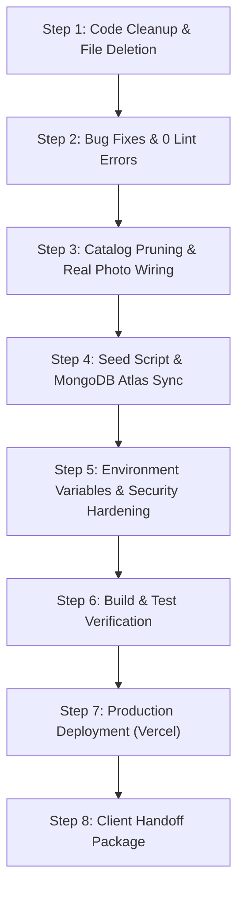

# Digitron Associates — System Audit, Cleanup & Client Delivery Plan

> **Client Hand-off & Production Readiness Document**  
> **Date:** September 2026  
> **Project:** Digitron Associates (CCTV & Security Solutions E-Commerce & Admin Platform)  
> **Stack:** React 19 + Vite 8 + Express 5 + Prisma 5 + MongoDB Atlas + Vercel

---

## 1. Executive Summary & Scan Results

A full system scan of the codebase was conducted to identify broken features, security vulnerabilities, dead files, asset bloat, and catalog inconsistencies prior to client delivery.

### Key Scan Findings
| Area | Status | Critical Issues | Action Required |
| :--- | :---: | :--- | :--- |
| **Code & Quality** | ❌ FAILED | 33 ESLint errors, React 19 render-in-effect violations, duplicate object keys | Fix all syntax and lifecycle violations to achieve 0 lint errors |
| **Catalog & Media** | ❌ BROKEN | 473 out of 487 products have broken `images: ["product"]` causing 404 network errors; 1 unused valid image | Prune catalog to ~10 curated products per category; link all valid photos; eliminate 404s |
| **File Bloat & Clutter** | ⚠️ BLOATED | Duplicate asset directory (`src/assets/productImages`), AI prompt dumps, unused foreign design systems | Remove all 11+ unnecessary files and redundant folders |
| **Environment & CORS** | ⚠️ AT RISK | Hardcoded production URL in `backend/.env` blocks local testing (`localhost:5173`); secrets exposed | Add dynamic multi-origin CORS, provide `.env.example`, secure credentials |
| **Backend & Database** | ⚠️ UNSTABLE | `backend/seed.js` crashes (missing `temp_products.json`); orphaned migration scripts in `package.json` | Rebuild `seed.js` with curated catalog; clean `package.json` scripts |
| **Admin & Client UX** | ⚠️ CLUTTERED | Admin displays 487 products with ₹0 prices and missing specs; dummy thumbnail navigation in detail page | Streamline admin view, sync seed data, wire real image galleries |

---

## 2. Broken Items & Bugs That Must Be Fixed

### A. Code & Syntax Bugs
1. **Duplicate Object Key in `src/components/layout/ProductCard.jsx` (Line 80 & 86)**:
   - `backgroundColor` is declared twice in the inline style object.
2. **React 19 Cascading Render Violations (`react-hooks/set-state-in-effect`)**:
   - `src/components/layout/Navbar.jsx`: Calling `setMobileOpen(false)` synchronously inside a `useEffect` on `location.pathname`.
   - `src/pages/CartPage.jsx`: Calling `setFormData` directly in `useEffect` when user changes.
   - `src/pages/CategoryPage.jsx`: Calling `setPageSize(20)` directly in `useEffect` on filter changes.
   - `src/pages/admin/AdminProductsTab.jsx`: Calling `setShowAddForm(true)` synchronously inside `useEffect`.
3. **Unused Imports & Variables (Failing `npm run lint`)**:
   - Unused `React` imports across React 19 components (`Button.jsx`, `Card.jsx`, `Chip.jsx`, `Input.jsx`, `Select.jsx`, `StatusLabel.jsx`, `Textarea.jsx`, test files).
   - Unused UI components imported in `CategoryPage.jsx` (`StatusLabel`, `Input`), `ProductDetailPage.jsx` (`Select`), `ProfilePage.jsx` (`ImagePlaceholder`, `Textarea`), `AdminProductsTab.jsx` (`ImagePlaceholder`, `Card`, `StatusLabel`, `Select`, `Input`, `Textarea`).
   - Unused backend variables: `jwt` in `backend/server.js`, `getHiddenProductIds` and `getSiteSettings` in `backend/routes/admin.routes.js`, `sanitizeQuantity` in `backend/routes/customer.routes.js`.

### B. Broken Image & Asset Issues
1. **473 Products with Invalid Image Path `images: ["product"]`**:
   - In `src/data/products.js`, almost all products have `"images": ["product"]`. When rendered by ``, the browser tries to fetch `http://localhost:5173/product` or `https://digitronx.vercel.app/product`, resulting in continuous 404 HTTP errors and broken layout boxes.
2. **Orphaned Image `camera-dahua-dome.jpeg`**:
   - `public/productImages/camera-dahua-dome.jpeg` is present on disk but was never assigned to product ID 561 (`Dahua 2 MP IP Dome Dh-Ipc-Hdw1230sp-S4`).
3. **Dummy Gallery Thumbnails on `ProductDetailPage.jsx`**:
   - The thumbnail row is hardcoded to `[1, 2, 3, 4]` showing camera/package placeholder icons instead of actual product images or clickable preview thumbnails.

### C. CORS & Configuration Flaws
1. **`backend/.env` vs Local Development**:
   - `FRONTEND_URL` is hardcoded to `https://digitronx.vercel.app`. When running locally, Vite runs on `http://localhost:5173`. Express rejects local requests due to CORS origin mismatch.
   - Fix: Configure CORS in `backend/server.js` to allow both `http://localhost:5173` and the deployed domain(s), or read from comma-delimited environment variables.
2. **Missing `.env.example`**:
   - No clean template exists for the client to input their own MongoDB URI, Gmail credentials, or Google OAuth keys.

### D. Broken Backend Scripts
1. **Broken Seed Script (`backend/seed.js`)**:
   - Requires `backend/temp_products.json` which is absent, causing `npm run seed` to abort immediately.
2. **Orphaned Database Migration Scripts in `backend/package.json`**:
   - `migrate:supabase:export` and `migrate:mongo:import` reference `node migrate/export-supabase.js` and `node migrate/import-mongo.js`. Neither the `migrate` folder nor those scripts exist.

---

## 3. Unnecessary Files to be Removed

The following files and folders have no function, contain duplicate data, or are leftover artifacts from previous templates and generation prompts:

| File / Folder Path | Reason for Removal | Space / Impact |
| :--- | :--- | :--- |
| `src/assets/productImages/` | **Exact duplicate** of `public/productImages/`. Public files are already served at root `/productImages/...`. Vite does not use this folder. | ~1.2 MB disk space saved |
| `design-system/` (`design-system/annapoorneshwari-enterprises/MASTER.md`) | Leftover design system specification from another company ("Annapoorneshwari Enterprises"). Completely unrelated to Digitron. | Eliminates client confusion |
| `original_prompt.txt` | Raw prompt instruction text file from initial prototype generation. Unprofessional to hand off to a client. | Repo hygiene |
| `src/components/ActivityLog.jsx` | Dead component. Admin activity logs are handled by `src/pages/admin/AdminActivityTab.jsx`. This component is never imported. | Eliminates dead code |
| `src/data/cameraSpecs.json` | 6 KB JSON file only used by one-off scratch scripts. Specs are already self-contained within `src/data/products.js`. | Redundant data |
| `src/scripts/exportToJson.js` | One-off Excel migration scratch script. Not used in production. | Repo hygiene |
| `src/scripts/generateAllCameraSpecs.js` | One-off scratch script for camera specs generation. | Repo hygiene |
| `src/scripts/updateCameraSpecs.cjs` | Duplicate one-off scratch script. | Repo hygiene |
| `src/scripts/updateCameraSpecs.js` | Duplicate one-off scratch script. | Repo hygiene |
| `src/assets/react.svg` | Default Vite starter SVG logo. Unused. | Template cleanup |
| `src/assets/vite.svg` | Default Vite starter SVG logo. Unused. | Template cleanup |
| `backend/MONGODB_MIGRATION.md` | Outdated migration notes referencing deprecated Supabase schema. | Repo hygiene |

---

## 4. Product Catalog Selection (~10 Products per Category)

To provide the client with a polished, commercial-grade catalog, we prune the 487-product raw list down to **~10 products per category** (~110 total), giving highest priority to products with authentic high-resolution images, complete technical specifications, verified stock, and industry-standard brands (CP Plus, Dahua, Hikvision, Seagate, Western Digital, Artis, D-Link).

### Valid Photo Mapping (14 Real Photos Linked Directly)
1. **CP Plus 2.4MP HD Dome** (ID 116) -> `/productImages/camera-cpplus-dome.jpeg`
2. **CP Plus 2.4MP HD Bullet Alt** (ID 117) -> `/productImages/camera-cpplus-bullet-alt.jpeg`
3. **CP Plus 2.4MP HD Bullet V3** (ID 238) -> `/productImages/camera-cpplus-bullet.jpeg`
4. **CP Plus 4MP IP PTZ Camera** (ID 370) -> `/productImages/camera-cpplus-ptz.jpeg`
5. **Dahua 2MP IP Dome Camera** (ID 561) -> `/productImages/camera-dahua-dome.jpeg` *(Recovered & Linked)*
6. **4G Mini PT Solar Linkage Camera** (ID 169) -> `/productImages/camera-solar-4g-pt.jpeg`
7. **Consistent 1TB Surveillance HDD** (ID 239) -> `/productImages/hdd-1tb-consistent-surveillance.jpeg`
8. **Western Digital Blue 1TB HDD** (ID 358) -> `/productImages/hdd-1tb-wd-blue.jpeg`
9. **Seagate 1TB External Surveillance HDD** (ID 152) -> `/productImages/hdd-external-seagate-1tb.jpeg`
10. **CP Plus 16-Channel 1-SATA NVR** (ID 304) -> `/productImages/nvr-cpplus.jpeg`
11. **Artis 1000VA / 1500VA Tablemate UPS** (ID 241) -> `/productImages/ups-1500va-artis.jpeg`
12. **2-Pair PVC CCTV Cable** (ID 297) -> `/productImages/cable-pvc-2pair.jpeg`
13. **2U Metal Network & DVR Rack** (ID 300) -> `/productImages/rack-2u-metal.jpeg`
14. **Heavy Duty Modular Crimping Tool** (ID 361) -> `/productImages/crimping-tool-kit.jpeg`

### Curated Category Breakdown (~10 items each)

| # | Category | Flagship & Photo Products | Representative Lineup (10 Items) |
| :-: | :--- | :--- | :--- |
| **1** | **Cameras** | CP Plus Dome, Bullet Alt, Bullet V3, PTZ, Solar 4G PT, Dahua Dome | 6 Photo models + Dahua 2MP IP Bullet (560), Hikvision 2MP Dome, Hikvision 4MP Bullet, CP Plus 5MP IP Outdoor |
| **2** | **Storage** | Consistent 1TB, WD Blue 1TB, Seagate External 1TB | 3 Photo models + Seagate SkyHawk 2TB, Seagate SkyHawk 4TB, WD Purple 2TB, WD Purple 4TB, Toshiba Surveillance 1TB, SanDisk High Endurance 64GB MicroSD, SanDisk 128GB MicroSD |
| **3** | **NVR** | CP Plus 16 Ch NVR (304) | CP Plus 16Ch + CP Plus 4Ch, CP Plus 8Ch, CP Plus 32Ch, Dahua 4Ch, Dahua 8Ch, Dahua 16Ch, Dahua 32Ch (559), Hikvision 8Ch, Hikvision 16Ch |
| **4** | **DVR** | High-demand HD DVRs | CP Plus 4Ch HD, CP Plus 8Ch HD, CP Plus 16Ch HD, CP Plus 32Ch HD, Dahua 4Ch HD-CVI, Dahua 8Ch HD-CVI, Dahua 16Ch, Hikvision 4Ch Turbo HD, Hikvision 8Ch Turbo HD, Hikvision 16Ch Turbo HD |
| **5** | **Power Supplies** | Artis 1000VA UPS (241) | Artis 1000VA UPS + Artis 600VA UPS, CP Plus 4-Channel Power Supply, CP Plus 8-Channel Power Supply, CP Plus 16-Channel Power Supply, ERD 12V 2A Adapter, 12V 5A Power Supply, Heavy Duty CCTV SMPS, Microtek UPS 650VA, Multi-Power 8Ch Centralized Unit |
| **6** | **Cables & Connectors** | 2-Pair PVC Cable (297) | 2-Pair PVC + D-Link Cat6 UTP 305m Box, Finolex 3+1 CCTV Cable 90m, Finolex 3+1 CCTV Cable 180m, RJ45 Modular Connectors (100 pack), BNC Copper Connectors (10 pack), DC Male/Female Jack Connectors (10 pack), High Speed HDMI Cable 5m, HDMI Cable 10m, Cat6 Molded Patch Cord 2m |
| **7** | **Networking** | Dahua 4-Port PoE (229), Dahua 8-Port PoE (231) | 2 Dahua PoE Switches + D-Link 8-Port Gigabit Switch, D-Link 16-Port PoE Switch, TP-Link 4G LTE Wireless Router, CP Plus 8-Port PoE Switch, Outdoor 5GHz Wireless CPE Bridge, Digisol 8-Port Switch, 10G SFP Optical Transceiver, Industrial DIN-Rail Switch |
| **8** | **Mounting & Enclosures** | 2U Metal Rack (300) | 2U Rack Metal + 4U Wall Mount Network Rack, 6U Wall Mount Rack with Glass Door, 9U Server Rack, Outdoor Waterproof Camera Junction Box, Heavy Duty PTZ Wall Bracket, Pole Mount Bracket with Straps, DVR Security Lockbox with Key, Universal Camera Spacer Base, Deep Base Junction Box |
| **9** | **Accessories** | Heavy Duty Crimping Tool (361) | Crimping Tool + RJ45/RJ11 Network Cable Tester, Wire Stripper & Cutter, Digital Multimeter, Heat Shrink Sleeve Assortment, Heavy Duty Nylon Cable Ties (Pack of 100), PVC Flexible Conduit Pipe 25mm, Coaxial BNC Crimper, BNC to VGA Converter, Warning Surveillance Stickers |
| **10** | **Displays** | Surveillance Monitors & Splitters | 19" LED Surveillance Monitor, 21.5" Full HD Monitor (HDMI/VGA), 24" Frameless IPS Display, 32" Wall-Mount Security Monitor, 4-Port HDMI Splitter 4K, 8-Port HDMI Splitter, VGA to HDMI Converter, HDMI Extender over Cat6 (60m), Dual Monitor Desk Mount, Ultra-Slim Wall Mount Bracket |
| **11** | **Services** | Turnkey Reseller & Service Offerings | CCTV Camera Installation (Per Point), Comprehensive Annual Maintenance Contract (AMC), Structured Network Cabling Service, Remote Mobile Viewing & DDNS Configuration, Security Audit & On-Site Consultation, NVR/DVR Firmware Upgrade & Health Check, Hard Disk Data Recovery Support, Solar CCTV Off-Grid Deployment, Access Control Integration, Biometric Attendance Setup |

---

## 5. End-to-End Steps: From Setup to Deployment & Client Handoff



### Step 1: File Pruning & Repository Hygiene
1. Delete redundant folder `src/assets/productImages/`.
2. Delete foreign design system directory `design-system/`.
3. Delete prototype leftovers: `original_prompt.txt`, `src/components/ActivityLog.jsx`, `src/data/cameraSpecs.json`, `src/assets/react.svg`, `src/assets/vite.svg`, `backend/MONGODB_MIGRATION.md`.
4. Delete scratch generation scripts `src/scripts/*.js` and remove orphan scripts from `backend/package.json`.

### Step 2: Code Quality & Zero-Lint Resolution
1. Correct duplicate keys in `ProductCard.jsx`.
2. Refactor state-in-effect calls in `Navbar.jsx`, `CartPage.jsx`, `CategoryPage.jsx`, and `AdminProductsTab.jsx`.
3. Remove unused React imports and unused component references across all pages.
4. Run `npm run lint` and verify **0 errors, 0 warnings**.

### Step 3: Catalog Curation & Fallback Elimination
1. Replace `src/data/products.js` with the clean ~110-item curated catalog.
2. Ensure every product has proper fallback handling (no broken `"product"` string).
3. Connect `camera-dahua-dome.jpeg` to product 561.
4. Enhance `ProductDetailPage.jsx` image viewer so that products with multiple photos allow smooth thumbnail switching, and single-photo products display elegant banners without dummy placeholder grids.

### Step 4: MongoDB Database Seeding
1. Update `backend/seed.js` to read directly from the curated product catalog.
2. Ensure categories (`Cameras`, `Storage`, `NVR`, `DVR`, `Power Supplies`, `Cables & Connectors`, `Networking`, `Mounting & Enclosures`, `Accessories`, `Displays`, `Services`) are upserted.
3. Test seeding into MongoDB Atlas and verify that `GET /api/products?admin=true` returns the clean ~110 products.

### Step 5: Environment Variables & Security
1. Create `backend/.env.example` with documented keys:
   ```env
   # Database Connection
   MONGODB_URI="mongodb+srv://<username>:<password>@cluster.mongodb.net/digitron?retryWrites=true&w=majority"

   # Authentication Secrets
   JWT_SECRET="generate-a-strong-secret-key-min-32-chars"
   SESSION_SECRET="generate-a-session-secret-key"
   SESSION_STORE="mongo"

   # Allowed Origins (comma-separated for dev & production)
   FRONTEND_URL="http://localhost:5173,https://digitronx.vercel.app"

   # Admin Credentials
   ADMIN_USERNAME="admin"
   ADMIN_PASSWORD_HASH="<bcrypt-hash-of-admin-password>"

   # Email Service (Nodemailer for Quote Requests)
   EMAIL_USER="your-email@gmail.com"
   EMAIL_PASS="your-16-character-gmail-app-password"

   # Google OAuth (Optional - for customer Google Sign-In)
   GOOGLE_CLIENT_ID=""
   GOOGLE_CLIENT_SECRET=""
   GOOGLE_CALLBACK_URL="https://digitronx.vercel.app/api/auth/google/callback"
   ```
2. Update `backend/server.js` CORS logic to support comma-separated origins in `FRONTEND_URL`.

### Step 6: Testing & Build Verification
1. Run `npm run test` (Vitest + backend test suite) -> Ensure all tests pass.
2. Run `npm run lint` -> 0 errors.
3. Run `npm run build` -> Ensure Vite bundles cleanly with smaller chunk sizes.

### Step 7: Deployment to Vercel
1. Link GitHub repository to Vercel.
2. In Vercel Project Settings:
   - **Framework Preset:** Vite
   - **Build Command:** `npm run build`
   - **Output Directory:** `dist`
3. Configure Vercel Environment Variables:
   - Add all variables from `backend/.env.example`.
4. Ensure `vercel.json` rewrites `/api/*` requests to `/api/index.js` and all other routes to `/index.html`.
5. Deploy and verify health check at `https://<your-domain>/api/health`.

### Step 8: Client Handoff Deliverables Checklist
Provide the client with:
- **Admin Portal Access**: URL (`/admin`), default username (`admin`), and instructions to change password via bcrypt generator.
- **Store Configuration**: How to change store phone, WhatsApp number, email, and address from the Admin Settings tab.
- **Quote Request Workflow**: Confirm quotes arrive in Gmail via Nodemailer and in the Admin Quotes tab.
- **Product Management Guide**: How to add, edit, hide, and restock products via the Admin Products tab.
- **Atlas DB Backup**: Regular export instructions using MongoDB Compass or Atlas Backup.

---
